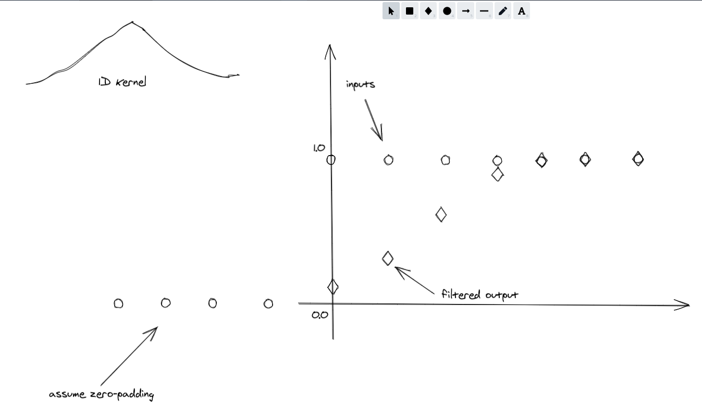

# Kernel Filter
This project is to implement a Kernel filter in Python and C++.

Kernel filter is a widely-used smoothing algorithm. Basically, we determine the filtered values by taking an weigted average of a surrounding neighbors of each value point. The weights are determined by an object called _kernel_. e.g. CNN uses a 2D kernel and the filtering process is called convolution. A most wellknown 1D kernel shape is perhaps the Gaussian curve. 

In this project, let's implement a 1D kernel in C++ and python.

Inputs are real numbers: they can be integers or floats.

e.g. for this array: 
* `[1,1,1,1,1,1,1]`, after filtering with a Gaussian-like kernel: `[0.1, 0.25, 0.3, 0.25, 0.1]`, the result should be: 
* `[0.1, 0.35, 0.65, 0.9, 1, 1]`

If we plot the original and the filtered values in a figure:

# Assignment
* write a python3 class `KernelFilter(kernel=np.array([0.1, 0.25, 0.3, 0.25, 0.1]))`, which takes a 1D array as the kernel definition.
* write python test script to use your `KernelFilter` class and make some plots in python to show results.
* write a C++ class and tests.
